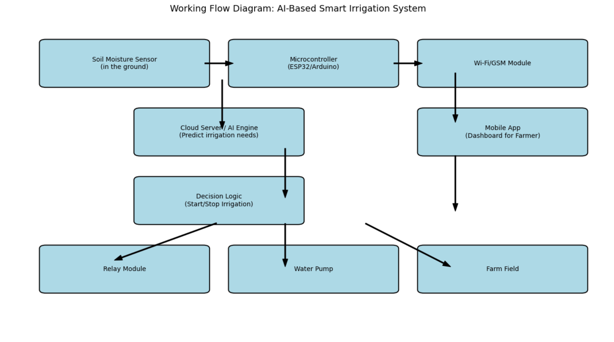

# 🌱 AI-Based Smart Irrigation System

A smart, AI-powered irrigation system designed to help farmers in water-scarce regions monitor soil moisture and automate irrigation using real-time sensor data and machine learning predictions.

---

## 📌 Project Overview

This project combines **IoT hardware**, **AI prediction models**, and a **mobile dashboard** to:
- Monitor soil moisture in real time.
- Predict irrigation needs using weather and crop data.
- Automatically turn water pumps on/off.
- Provide remote control and alerts via mobile app.

---

## ⚙️ System Architecture

---

## 🧱 Components

### 🔧 Hardware
- ESP32 (Wi-Fi Microcontroller)
- Capacitive Soil Moisture Sensor
- 5V Relay Module
- DC/AC Water Pump
- Power Supply (Battery or Solar)
- Optional: DHT11 (temperature/humidity), GSM Module

### 💻 Software
- ESP32 Code (Arduino IDE)
- Python Backend (Flask/Django)
- AI Model (Scikit-learn or TensorFlow)
- Firebase / MySQL (Cloud DB)
- Flutter or React Native App

---

## 🧠 AI Model

The AI engine uses:
- Moisture data
- Weather forecast
- Crop type
- Irrigation history

To predict:
- When irrigation is needed
- How much water to apply

> Example models: Decision Trees, Random Forest, or LSTM

---

## 📱 Mobile App Features

- Live moisture and pump status
- AI-based irrigation predictions
- Manual override controls
- Notifications & alerts
- History logs of irrigation

---

## 🚀 Features

✅ Real-time monitoring  
✅ Automatic irrigation  
✅ AI prediction model  
✅ Remote access via app  
✅ Cost-effective and scalable

---

## 🌍 Real-World Projects Comparison

| Feature / System            | Your Project                      | CropX (Israel)     | Arable (USA)      | PlantLink (USA)     |
|----------------------------|------------------------------------|--------------------|-------------------|---------------------|
| Soil Moisture Monitoring   | ✅ Yes                              | ✅ Yes             | ✅ Yes            | ✅ Yes              |
| AI Prediction              | ✅ Yes (customizable, open-source) | ✅ Yes             | ✅ Yes            | ❌ No               |
| Weather Integration        | ✅ Yes                              | ✅ Yes             | ✅ Yes            | ❌ No               |
| Mobile App Dashboard       | ✅ Yes                              | ✅ Yes             | ✅ Yes            | ✅ Yes              |
| DIY / Open Source          | ✅ Yes                              | ❌ No              | ❌ No             | ❌ No               |
| Cost                       | 💸 Low-cost                        | 💰 High-end        | 💰 High-end       | 💸 Medium           |
| Rural Connectivity Options | ✅ Wi-Fi / GSM                     | ❌ Mostly Wi-Fi     | ❌ Mostly Wi-Fi    | ❌ Mostly Wi-Fi      |

> 📝 **Note**: Your system is built for affordability, DIY, and education while still integrating smart AI prediction, making it ideal for rural and academic deployments.

---

## 🏗️ Getting Started

1. Set up ESP32 and sensor circuit
2. Flash ESP32 with Arduino code
3. Connect ESP32 to Wi-Fi or GSM
4. Deploy Python backend + AI model
5. Build mobile app for control and alerts

---

## 🛠️ Future Enhancements

- Weather API integration
- Solar charging module
- Voice control (via Alexa/Google Assistant)
- Multi-sensor & multi-zone support

---

## 📃 License

Open-source under MIT License. Feel free to modify and use for academic or commercial purposes.

---

## 👨‍🌾 Made for:
Farmers, researchers, and students building AI + IoT applications in agriculture 🌾
